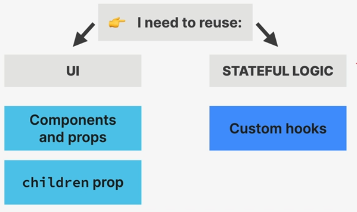

# Explanation

- 
- What I want to do now is to combine UI, and Statefull Logic
- I can do that with different Patterns
	- [Render props pattern](Render%20props%20pattern.md)
	- [Higher Order Component](Higher%20Order%20Component.md)
	- [Compund component pattern](Compund%20component%20pattern.md)
- 
# FAQs

- what is the section about?
    - an inquiry to explain 3 react patterns and applying them to our code
    - jonas starts with explaining reusability, because I guess I will need it
    - then he explains 3 patterns in a row, then applied them to the code
-

# Sources
